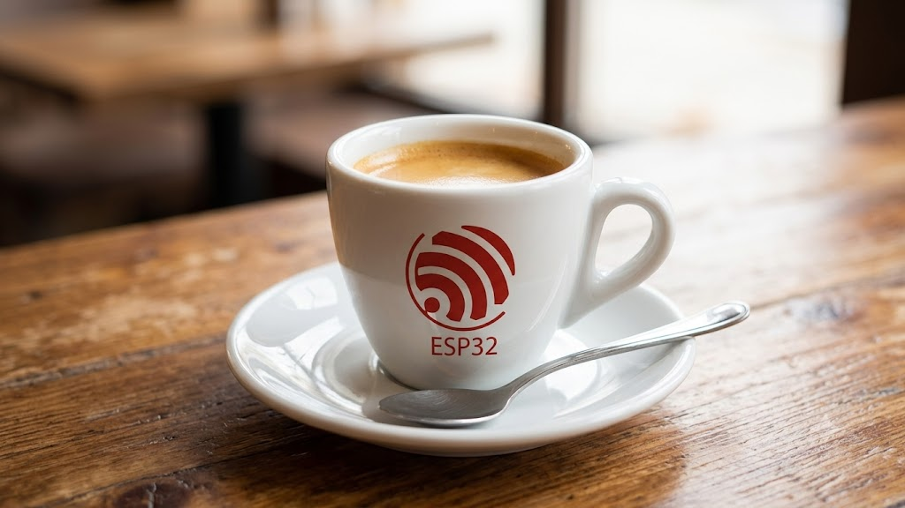

# Esp32esso

> An ESP32 brain for "most" pump espresso machines, with a tiered hardware
> install path and an optional native Android app that replaces the
> on-machine screen.

Esp32esso ("ESP32 espresso") is heavily inspired by
[Gaggiuino](https://gaggiuino.github.io/) but built from scratch with two
deliberate differences:

1. A single **ESP32** runs both the real-time control loop and the BLE/UI
   side. No dedicated STM32 companion MCU. A cheap classic **ESP32-WROOM**
   is enough for Tier 1; an **ESP32-S3** is recommended once you move up to
   the Tier 2-4 roadmap (see [Supported boards](#supported-boards)).
2. A **machine-abstraction layer** (HAL + per-machine profile) lets the same
   firmware target many pump machines instead of just the Gaggia Classic
   family. The first profile is the **Oster Xpert** (a rebrand of the Chinese
   Sunbeam Barista Max pump-espresso platform).

See [`CREDITS.md`](CREDITS.md) for full attribution.

---

> [!WARNING]
> This project touches mains voltage, a heater capable of boiling water, and
> a pressurised brew group. Bad work can cause electrocution, fires, scalding,
> and machine destruction. You alone are responsible for your installation.
> If you do not understand mains wiring, grounding, isolation, and basic
> electrical safety, **stop and learn the fundamentals first** or hire a
> qualified electrician. This software is provided WITHOUT WARRANTY (see
> [`LICENSE`](LICENSE)).

---

## What you can do with it

- Hold brew temperature within ~1 C of setpoint using closed-loop PID on the
  existing heater, instead of relying on the stock bang-bang thermostat.
- Monitor pressure, flow, weight, shot time, and temperature live from your
  phone over Bluetooth Low Energy.
- Profile pressure and flow during the shot (pre-infusion, ramp, decline,
  blooming, etc.).
- Stop-on-weight / predictive scales so the shot ends at the exact yield you
  want.
- Save, edit, import, and share shot profiles from the companion Android app.

## Hardware install tiers

Esp32esso is designed so you can stop at any tier. Tier 1 is the smallest,
safest mod; each subsequent tier adds features and electrical complexity.

| Tier | Adds | What it gives you | Invasiveness |
| ---- | ---- | ----------------- | ------------ |
| **Tier 1 - Temperature brain** | SSR + thermocouple/RTD on the existing heater | Closed-loop PID brew temperature, BLE telemetry of temp | Low - one low-voltage probe and one high-voltage relay in series with the existing thermostat path |
| **Tier 2 - Sensing & telemetry** | Pressure transducer + brew-switch sense | Live pressure curve and auto shot timer over BLE; pump still on/off | Medium - one plumbing tap and one mains-side signal pickup |
| **Tier 3 - Active pressure / flow control** | Zero-cross detector + TRIAC dimmer on the pump | Pressure & flow profiling, pre-infusion, declining profiles | High - inline AC dimmer on the pump |
| **Tier 4 - Full bar** | Load-cell scales, water-level sensor, optional embedded display, OTA, profile sharing | Stop-on-weight / predictive yield, tank monitoring, standalone use without the phone, community profiles | High - mechanical and electronic add-ons |

A per-tier bill of materials lives under [`hardware/`](hardware/) and grows
alongside each stage of development.

## Supported boards

Tier 1 runs on **any ESP32 dev board**. The classic **ESP32-WROOM** is the
primary target while the project is young: it is the cheapest way in and the
one we are validating the whole experience on first. An **ESP32-S3** is
recommended once you move up to Tier 2-4, where the extra flash, PSRAM, and
CPU headroom matter for BLE, live profiling, and OTA.

| Board | Flash / PSRAM | Tier 1 | Tier 2-4 | Notes |
| ----- | ------------- | ------ | -------- | ----- |
| **ESP32-WROOM** (DevKit, NodeMCU-32S, ...) | ≥ 4 MB / none | Supported (primary target) | Should work; being validated | Cheapest entry. Uses its own safe GPIO map. |
| **ESP32-S3** (DevKitC-1, N16R8, ...) | ≥ 8 MB / 2-8 MB | Supported | Recommended | Headroom for the full roadmap. |

Pick the board first, then flash the matching env (`esp32-*` for classic
ESP32, `esp32-s3-*` for the S3). Flashing S3 firmware onto a classic ESP32
(or vice versa) fails at upload with a clear chip-mismatch error.

## Project status

| Stage | Theme | Status |
| ----- | ----- | ------ |
| **1** | Foundation + Tier 1 (Oster Xpert temp control) | in progress |
| **2** | BLE GATT spec + Android app MVP + Tier 2 | planned |
| **3** | Pressure & flow profiling + Tier 3 | planned |
| **4** | Scales, OTA, profile sharing, multi-machine, docs site + Tier 4 | planned |

The detailed roadmap lives in [`docs/roadmap.md`](docs/roadmap.md).

## Repository layout

```
firmware/      PlatformIO ESP32 project (real-time control + BLE)
app-android/   Kotlin / Jetpack Compose companion app (Stage 2+)
protocol/      Single source of truth for the BLE GATT contract
hardware/      KiCad schematics, wiring diagrams, per-tier BOM
docs/          Long-form docs, install guides, machine profiles
.github/       Issue/PR templates and CI
```

## Quick start (developers)

Prerequisites:

- [PlatformIO Core](https://platformio.org/install/cli) (`pio --version`)
- A USB cable and an ESP32 dev board (Tier 1 only requires the bare board
  + a `MAX31855` thermocouple amplifier + an SSR-capable GPIO). A classic
  ESP32-WROOM is the primary target; an ESP32-S3 also works.

Build and flash the firmware for the Oster Xpert profile. Use the env that
matches your board (`esp32-oster-xpert` for a classic ESP32-WROOM,
`esp32-s3-oster-xpert` for an ESP32-S3):

```bash
cd firmware
pio run -e esp32-oster-xpert -t upload      # classic ESP32-WROOM
# pio run -e esp32-s3-oster-xpert -t upload # ESP32-S3
pio device monitor
```

The Tier 1 Android companion app lives under [`app-android/`](app-android/).
Build and install it from Android Studio (see [`app-android/README.md`](app-android/README.md)),
then connect over BLE to set the brew temperature and watch live heater state.

## Screenshots


## Contributing

Issues, hardware reports for new machines, and pull requests are welcome.
Start with [`CONTRIBUTING.md`](CONTRIBUTING.md) and the
[Code of Conduct](CODE_OF_CONDUCT.md). Security-sensitive reports (anything
that could put a user's safety at risk) should follow
[`SECURITY.md`](SECURITY.md).

## License

Esp32esso is licensed under the GNU General Public License v3.0 or later.
See [`LICENSE`](LICENSE).

This project is independent. It is **not** affiliated with, endorsed by, or
derived from Gaggiuino, Gaggia, Oster, or any espresso-machine manufacturer.
"Oster" and "Gaggia" are trademarks of their respective owners and are used
here strictly for descriptive compatibility purposes.
