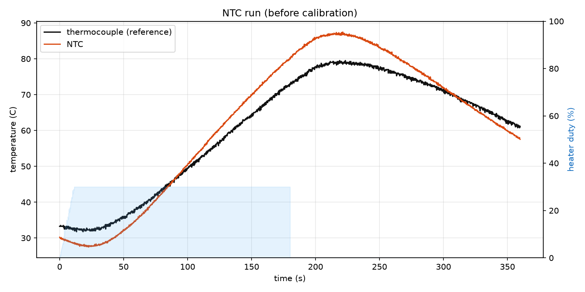
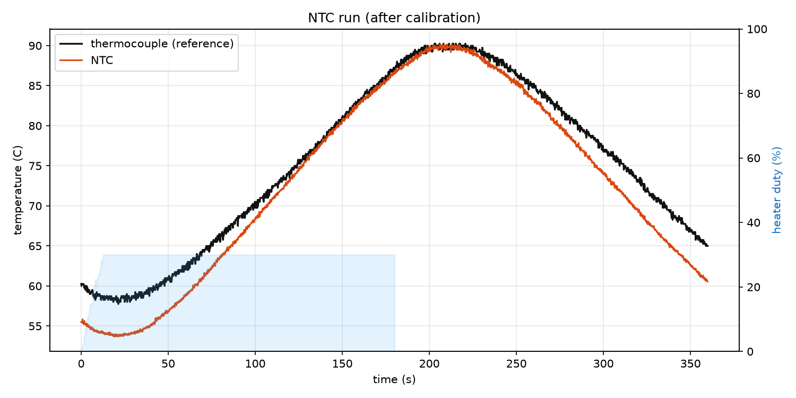
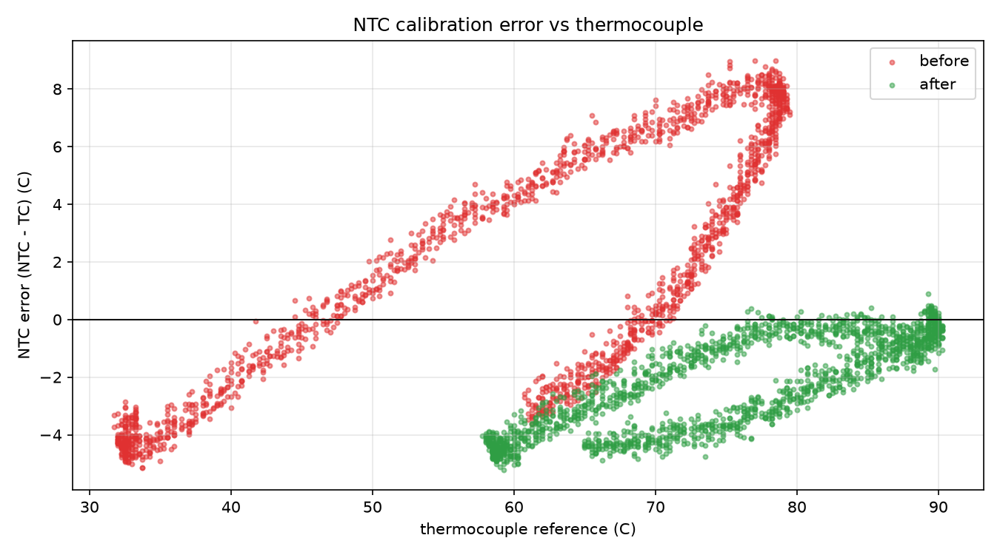

# Oster Xpert - Tier 2 sensor calibration

Tier 2 runs two temperature probes (see [`tier-2-wiring.md`](tier-2-wiring.md)):

- the **group thermocouple** — the trusted reference, and
- the **thermoblock NTC** — the stock sensor, whose °C depends on a two-value
  model (`R0`, `Beta`) that must be fitted to the physical device.

This doc covers how to calibrate both. There are **two approaches**, and you can
mix them:

1. **Fixed-point (ice + boiling water).** Two known temperatures, no mains, works
   for either sensor. Quick, but the two points sit far from the brew band, so
   accuracy in the 90–110 °C region relies on extrapolation.
2. **Common-heater sweep.** Clamp both probes to one thermal mass, heat through
   the brew band, and fit the NTC to the thermocouple across many points. More
   setup, but it calibrates *where it matters* and is what the automated bench
   in [`../../tools/ntc-cal/`](../../tools/ntc-cal/) does.

> [!NOTE]
> A K-type thermocouple through a MAX6675 is usually accurate to a few °C out of
> the box and needs no fit — you mostly **verify** it and note any offset. The
> NTC is the sensor that genuinely needs calibration.

---

## Approach 1 — Fixed-point (ice bath + boiling water)

Two reference temperatures anyone can make in a kitchen. Stir well and give each
probe time to settle before reading.

| Point | Temperature | How |
| ----- | ----------- | --- |
| Ice point | **0 °C** | Packed **crushed** ice + a little water, stirred. Not ice cubes floating in water. |
| Steam point | **~100 °C** | **Rolling boil.** Correct for altitude (see below). |

**Boiling point vs altitude** (water boils cooler as you climb):

| Altitude | Boiling point |
| -------- | ------------- |
| 0 m (sea level) | 100.0 °C |
| 500 m | ~98.3 °C |
| 1000 m | ~96.7 °C |
| 1500 m | ~95.1 °C |
| 2000 m | ~93.4 °C |

A quick rule: subtract **~0.33 °C per 100 m** of elevation.

### Thermocouple (verify / offset)

1. Dip the group probe in the stirred ice bath; read the app's group temperature
   (or `grp` in the serial telemetry).
2. Repeat in boiling water.
3. If both points are within ~2–3 °C of 0 °C and the altitude-corrected boiling
   point, the thermocouple is fine as-is. A consistent offset (e.g. reads 3 °C
   high at both points) can be trimmed in the group-sensor path; a *sloped* error
   (fine at 0, off at 100) usually means a bad probe or amp.

### NTC (2-point Beta fit)

The NTC's temperature comes from the Beta (B-parameter) model:

```text
1/T = 1/T0 + (1/Beta) * ln(R / R0)      (T in kelvin, T0 = 298.15 K = 25 °C)
```

1. Read the **NTC resistance** at each fixed point. The firmware reports
   `r_ntc_ohm` (independent of the current calibration); or measure the probe
   directly with a multimeter at that temperature.
2. With `(T1, R1)` at the ice point and `(T2, R2)` at boiling (T in **kelvin**),
   solve Beta:

```text
Beta = ln(R1 / R2) / (1/T1 - 1/T2)
```

3. Back out `R0` at 25 °C from either point:

```text
R0 = R1 * exp( -Beta * (1/T1 - 1/T0) )
```

4. Push the values live and persist them (over serial, using the tool):

```bash
python3 tools/ntc-cal/ntc_cal.py fit --csv two_point.samples.csv --apply --port /dev/ttyUSB0
# or set them by hand: `ntc set <R0> <Beta>` then `ntc save`
```

**Trade-off.** Two points fix the model exactly *at 0 and 100 °C* but any
curvature or self-heating error shows up as drift in between — and the brew band
(90–110 °C) is right at the edge of, or above, the calibrated range. For espresso
accuracy, prefer Approach 2, which puts the calibration points *in* the brew
band.

---

## Approach 2 — Common-heater sweep (recommended)

Clamp **both probes to the same thermal mass**, heat it slowly through the brew
band, and fit the NTC to the thermocouple. Because both probes see the same real
temperature, the thermocouple becomes a live reference at every point — not just
two — so the fit is accurate exactly where you brew.

### What makes a good heater

Any heat source works as long as it can:

- **Reach the brew band** (~90–110 °C) so the fit covers real operating temps.
- **Heat slowly and hold**, so both probes can settle at the same temperature
  (see "Settle, don't ramp" below).
- **Grip both probes in good thermal contact** with the same mass.

Common options people already own:

| Heater | Notes |
| ------ | ----- |
| **Soldering iron tip** | What this project used on the bench (small mass, fast, easy to clamp both probes to the tip). Great with a controllable driver. |
| **3D-printer hotend or heated bed** | Excellent: **PID-controlled to exact setpoints**, so you can command 50/70/90/110 °C and let it settle. The hotend is small-mass and fast; the bed is large-mass and very stable. |
| **Hot plate / mug warmer / electric skillet** | Large stable mass; set low and let it climb. |
| **Heat gun / hair dryer** | Cheap and everywhere, but airflow makes it noisy and hard to hold a steady temperature — insulate the probes from the airstream. |
| **Space heater / oven** | Big thermal mass, slow and stable; oven can hold a setpoint but is coarse. |
| **A mug of just-boiled water, cooling** | Zero equipment: clamp both probes in the water and log as it cools from ~95 °C down. Gives a clean settled curve for free. |

The point is generic: **use whatever you have** that hits the brew band and lets
both probes equalise.

### Settle, don't ramp

The single most important rule. During a **continuous ramp**, the NTC bead and
the thermocouple sit at slightly *different* real temperatures because they have
different thermal time constants — one lags the other. Fit that data and the lag
shows up as a **hysteresis loop** (NTC reads hot on the way up, cold on the way
down) that poisons the Beta fit.

Instead, **hold at a temperature until both probes stop changing**, then capture
one point. Repeat at several temperatures spread across the band. Only settled
points — where both probes actually agree — are trustworthy.

### The bench example (soldering iron + firmware bench)

This is what we actually ran; treat it as one concrete instance of the generic
method:

1. **Thermal mass:** a soldering-iron tip. Both the group thermocouple and the
   thermoblock NTC were clamped to the same tip so they shared one temperature.
2. **Heater drive:** the iron's heater was switched by the machine's **SSR**, the
   same output the firmware already uses for the boiler, so no extra hardware.
3. **Control:** the firmware's calibration bench walks a **target-temperature
   soak** — a proportional law drives the heater toward each rung (e.g.
   50 → 70 → 90 → 110 °C), and a point is captured **only once the thermocouple
   has settled** (stays inside a 0.6 °C band for a dwell). A dedicated **200 °C
   thermocouple hard-cut** protects the low-mass tip.
4. **Supervisor:** the Python tool in [`../../tools/ntc-cal/`](../../tools/ntc-cal/)
   records the run, least-squares-fits `R0`/`Beta` on the settled points, pushes
   them to the board, and persists them to NVS:

   ```bash
   python3 tools/ntc-cal/ntc_cal.py auto --port /dev/ttyUSB0 --end 110 --step 20 --duty 60 --prefix ntc_cal
   ```

If you use a **3D-printer hotend or heated bed** instead, you can skip the SSR
entirely: command the printer to each setpoint, let it settle, and log
`r_ntc_ohm` vs the thermocouple at each hold — then feed those points to
`ntc_cal.py fit`. The firmware bench just automates the "drive + settle +
capture" loop for people using the machine's own SSR.

---

## Results — why the calibration worked

The bench run above, before and after fitting `R0`/`Beta`:

### Before



Heating both probes on the shared tip, the **NTC (orange)** and **thermocouple
(black)** pull apart badly: on the way up the NTC runs several degrees off and
peaks ~8 °C high, and on the way down the curves swap — the classic signature of
an **uncalibrated Beta plus thermal lag** between the two probes.

### After



With the fitted `R0`/`Beta`, the two probes **track together on the heating
ramp** and through the peak in the brew band (~90 °C). The remaining gap appears
mostly on the **cool-down**, where the NTC trails the thermocouple — that is the
two probes' different thermal time constants, i.e. transient **lag**, not a
static calibration error.

### Error vs temperature (before vs after)



This is the clearest view: **NTC error `(NTC − TC)` against the thermocouple
reference**.

- **Before (red):** a wide **hysteresis loop** with a strong temperature slope —
  error swings from about −4 °C at the low end to **+8 °C** near the top. The NTC
  was simply wrong across the band, and differently wrong heating vs cooling.
- **After (green):** the loop **collapses into a tight band** and, crucially, the
  error crosses **~0 °C right in the brew band (≈90 °C)** where it matters. The
  large systematic slope is gone.

**Why it succeeded:** fitting on **settled points** — where both probes read the
same real temperature — removed the ramp-lag hysteresis from the fit, so the
Beta model captured the NTC's true resistance-vs-temperature curve. The result
is near-zero error at the operating point. The small residual spread you still
see in the "after" cloud is the *transient* two-probe lag on a fast-moving bench
(a measurement artifact of clamping two different-mass probes to one tip), not an
error the machine will have in steady-state brewing, where the thermoblock
changes slowly.

---

## Applying and persisting results

- **Live + NVS (survives reboot):** `ntc_cal.py ... --apply` (or `ntc set` then
  `ntc save`). NVS values override the compiled default on boot.
- **Bake into source (fresh flashes start calibrated):** edit `kThermoblockNtcCal`
  in [`../../firmware/src/profile/oster_xpert.cpp`](../../firmware/src/profile/oster_xpert.cpp)
  with the reported `R0`/`Beta`.

The full supervisor workflow (shakedown, `run`/`fit`/`verify`/`auto`, plot
outputs, serial protocol) is documented in
[`../../tools/ntc-cal/README.md`](../../tools/ntc-cal/README.md).

## Safety

- A dedicated **200 °C thermocouple hard-cut** trips the heater during a bench
  run, independent of the NTC being characterised.
- Heater **duty is clamped** (default 30 %, capped in firmware) to protect
  low-mass tips.
- `Ctrl-C` in any tool command sends `cal stop`; do the first run with a lighter
  / no mains and **watch the SSR LED cycle** before connecting a mains heater.
- The NTC driver flags a **fault** (and the loop falls back to safe behaviour) if
  the ADC pins to either rail — the NTC is open or shorted — or if the computed
  temperature leaves the −10…200 °C plausibility window.
